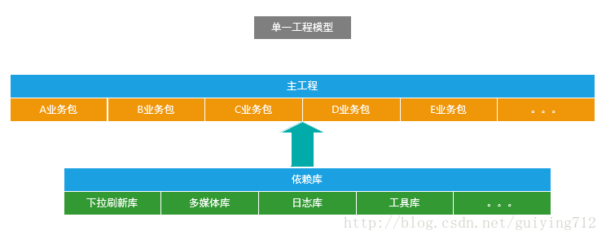
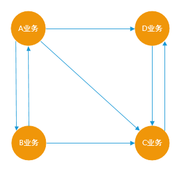
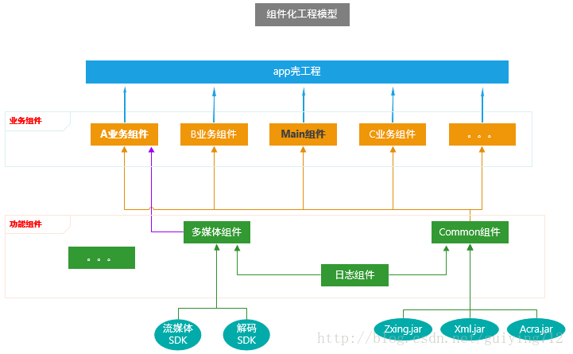
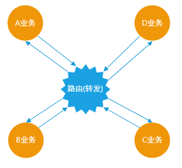
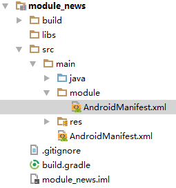
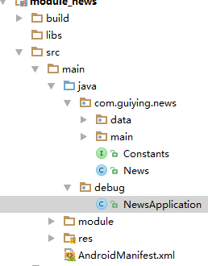

## Android组件化方案

# 1、为什么要项目组件化

随着APP版本不断的迭代，新功能的不断增加，业务也会变的越来越复杂，APP业务模块的数量有可能还会继续增加，而且每个模块的代码也变的越来越多，这样发展下去单一工程下的APP架构势必会影响开发效率，增加项目的维护成本，每个工程师都要熟悉如此之多的代码，将很难进行多人协作开发，而且Android项目在编译代码的时候电脑会非常卡，又因为单一工程下代码耦合严重，每修改一处代码后都要重新编译打包测试，导致非常耗时，最重要的是这样的代码想要做单元测试根本无从下手，所以必须要有更灵活的架构代替过去单一的工程架构。



上图是目前比较普遍使用的Android APP技术架构，往往是在一个界面中存在大量的业务逻辑，而业务逻辑中充斥着各种网络请求、数据操作等行为，整个项目中也没有模块的概念，只有简单的以业务逻辑划分的文件夹，并且业务之间也是直接相互调用、高度耦合在一起的；




上图单一工程模型下的业务关系，总的来说就是：你中有我，我中有你，相互依赖，无法分离。 
然而随着产品的迭代，业务越来越复杂，随之带来的是项目结构复杂度的极度增加，此时我们会面临如下几个问题：

1、实际业务变化非常快，但是单一工程的业务模块耦合度太高，牵一发而动全身； 
2、对工程所做的任何修改都必须要编译整个工程； 
3、功能测试和系统测试每次都要进行； 
4、团队协同开发存在较多的冲突.不得不花费更多的时间去沟通和协调，并且在开发过程中，任何一位成员没办法专注于自己的功能点，影响开发效率； 
5、不能灵活的对业务模块进行配置和组装；

为了满足各个业务模块的迭代而彼此不受影响，更好的解决上面这种让人头疼的依赖关系，就需要整改App的架构

# 2、如何组件化



上图是组件化工程模型，为了方便理解这张架构图，下面会列举一些组件化工程中用到的名词的含义：

| 名词       | 含义                                                         |
| ---------- | ------------------------------------------------------------ |
| 集成模式   | 所有的业务组件被“app壳工程”依赖，组成一个完整的APP           |
| 组件模式   | 可以独立开发业务组件，每一个业务组件就是一个APP；            |
| app壳工程  | 负责管理各个业务组件，和打包apk，没有具体的业务功能；        |
| 业务组件   | 根据公司具体业务而独立形成一个的工程                         |
| 功能组件   | 提供开发APP的某些基础功能，例如打印日志、树状图等；          |
| Main组件   | 属于业务组件，指定APP启动页面、主界面；                      |
| Common组件 | 属于功能组件，支撑业务组件的基础，提供多数业务组件需要的功能，例如提供网络请求功能； |

Android APP组件化架构的目标是告别结构臃肿，让各个业务变得相对独立，业务组件在组件模式下可以独立开发，而在集成模式下又可以变为arr包集成到“app壳工程”中，组成一个完整功能的APP； 从组件化工程模型中可以看到，业务组件之间是独立的，没有关联的，这些业务组件在集成模式下是一个个library，被app壳工程所依赖，组成一个具有完整业务功能的APP应用，但是在组件开发模式下，业务组件又变成了一个个application，它们可以独立开发和调试，由于在组件开发模式下，业务组件们的代码量相比于完整的项目差了很远，因此在运行时可以显著减少编译时间



这是组件化工程模型下的业务关系，业务之间将不再直接引用和依赖，而是通过“路由”这样一个中转站间接产生联系，而Android中的路由实际就是对URL Scheme的封装； 
如此规模大的架构整改需要付出更高的成本，还会涉及一些潜在的风险，但是整改后的架构能够带来很多好处：

1、加快业务迭代速度，各个业务模块组件更加独立，不再出现业务耦合情况； 
2、稳定的公共模块采用依赖库方式，提供给各个业务线使用，减少重复开发和维护工作量； 
3、迭代频繁的业务模块采用组件方式，各业务研发可以互不干扰、提升协作效率，并控制产品质量； 
4、为新业务随时集成提供了基础，所有业务可上可下，灵活多变； 
5、降低团队成员熟悉项目的成本，降低项目的维护难度； 
6、加快编译速度，提高开发效率

7、控制代码权限，将代码的权限细分到更小的粒度；


# 3、组件化实施流程

1. #### 组件模式和集成模式的转换

   1、**application属性**，可以独立运行的Android程序，也就是我们的APP；

   ```java
   apply plugin: ‘com.android.application’
   ```

   2、**library属性**，不可以独立运行，一般是Android程序依赖的库文件；

   ```
   apply plugin: ‘com.android.library’
   ```

   Module的属性是在每个组件的 build.gradle 文件中配置的，当我们在组件模式开发时，业务组件应处于application属性，这时的业务组件就是一个 Android App，可以独立开发和调试；而当我们转换到集成模式开发时，业务组件应该处于 library 属性，这样才能被我们的“app壳工程”所依赖，组成一个具有完整功能的APP；

   但是我们如何让组件在这两种模式之间自动转换呢？总不能每次需要转换模式的时候去每个业务组件的 Gralde 文件中去手动把 Application 改成 library 吧？如果我们的项目只有两三个组件那么这个办法肯定是可行的，手动去改一遍也用不了多久，但是在大型项目中我们可能会有十几个业务组件，再去手动改一遍必定费时费力，这时候就需要程序员发挥下懒的本质了。

   试想，我们经常在写代码的时候定义静态常量，那么定义静态常量的目的什么呢？当一个常量需要被好几处代码引用的时候，把这个常量定义为静态常量的好处是当这个常量的值需要改变时我们只需要改变静态常量的值，其他引用了这个静态常量的地方都会被改变，做到了一次改变，到处生效；根据这个思想，那么我们就可以在我们的代码中的某处定义一个决定业务组件属性的常量，然后让所有业务组件的build.gradle都引用这个常量，这样当我们改变了常量值的时候，所有引用了这个常量值的业务组件就会根据值的变化改变自己的属性；可是问题来了？静态常量是用Java代码定义的，而改变组件属性是需要在Gradle中定义的，Gradle能做到吗？

   Gradle自动构建工具有一个重要属性，可以帮助我们完成这个事情。每当我们用AndroidStudio创建一个Android项目后，就会在项目的根目录中生成一个文件 gradle.properties，我们将使用这个文件的一个重要属性：在Android项目中的任何一个build.gradle文件中都可以把gradle.properties中的常量读取出来；那么我们在上面提到解决办法就有了实际行动的方法，首先我们在gradle.properties中定义一个常量值 isModule（是否是组件开发模式，true为是，false为否）

   ```
   # 每次更改“isModule”的值后，需要点击 "Sync Project" 按钮
   isModule=false
   ```

   然后我们在业务组件的build.gradle中读取 isModule，但是 gradle.properties 还有一个重要属性： gradle.properties 中的数据类型都是String类型，使用其他数据类型需要自行转换；也就是说我们读到 isModule 是个String类型的值，而我们需要的是Boolean值，代码如下

   ```
   if (isModule.toBoolean()) {
       apply plugin: 'com.android.application'
   } else {
       apply plugin: 'com.android.library'
   }
   ```

   这样我们第一个问题就解决了，当然了 **每次改变isModule的值后，都要同步项目才能生效**

2. #### 组件之间AndroidManifest合并问题

在 AndroidStudio 中每一个组件都会有对应的 AndroidManifest.xml，用于声明需要的权限、Application、Activity、Service、Broadcast等，当项目处于组件模式时，业务组件的 AndroidManifest.xml 应该具有一个 Android APP 所具有的的所有属性，尤其是声明 Application 和要 launch的Activity，但是当项目处于集成模式的时候，每一个业务组件的 AndroidManifest.xml 都要合并到“app壳工程”中，要是每一个业务组件都有自己的 Application 和 launch的Activity，那么合并的时候肯定会冲突，试想一个APP怎么可能会有多个 Application 和 launch 的Activity呢？

但是大家应该注意到这个问题是在组件开发模式和集成开发模式之间转换引起的问题，而在上一节中我们已经解决了组件模式和集成模式转换的问题，另外大家应该都经历过将 Android 项目从 Eclipse 切换到 AndroidStudio 的过程，由于 Android 项目在 Eclipse 和 AndroidStudio开发时 AndroidManifest.xml 文件的位置是不一样的，我们需要在build.gradle 中指定下 AndroidManifest.xml 的位置，AndroidStudio 才能读取到 AndroidManifest.xml，这样解决办法也就有了，我们可以为组件开发模式下的业务组件再创建一个 AndroidManifest.xml，然后根据isModule指定AndroidManifest.xml的文件路径，让业务组件在集成模式和组件模式下使用不同的AndroidManifest.xml，这样表单冲突的问题就可以规避了



上图是组件化项目中一个标准的业务组件目录结构，首先我们在main文件夹下创建一个module文件夹用于存放组件开发模式下业务组件的 AndroidManifest.xml，而 AndroidStudio 生成的 AndroidManifest.xml 则依然保留，并用于集成开发模式下业务组件的表单；然后我们需要在业务组件的 build.gradle 中指定表单的路径，代码如下：

```
 sourceSets {
        main {
            if (isModule.toBoolean()) {
                manifest.srcFile 'src/main/module/AndroidManifest.xml'
            } else {
                manifest.srcFile 'src/main/AndroidManifest.xml'
            }
        }
    }

```


这样在不同的开发模式下就会读取到不同的 AndroidManifest.xml ，然后我们需要修改这两个表单的内容以为我们不同的开发模式服务。

首先是集成开发模式下的 AndroidManifest.xml，前面我们说过集成模式下，业务组件的表单是绝对不能拥有自己的 Application 和 launch 的 Activity的，也不能声明APP名称、图标等属性，总之app壳工程有的属性，业务组件都不能有，下面是一份标准的集成开发模式下业务组件的 AndroidManifest.xml：


```
<manifest xmlns:android="http://schemas.android.com/apk/res/android"
    package="com.guiying.girls">

    <application android:theme="@style/AppTheme">
        <activity
            android:name=".main.GirlsActivity"
            android:screenOrientation="portrait" />
        <activity
            android:name=".girl.GirlActivity"
            android:screenOrientation="portrait"
            android:theme="@style/AppTheme.NoActionBar" />
    </application>

</manifest>

```

我在这个表单中只声明了应用的主题，而且这个主题还是跟app壳工程中的主题是一致的，都引用了common组件中的资源文件，在这里声明主题是为了方便这个业务组件中有使用默认主题的Activity时就不用再给Activity单独声明theme了。

然后是组件开发模式下的表单文件：


```
<manifest xmlns:android="http://schemas.android.com/apk/res/android"
    package="com.guiying.girls">

    <application
        android:name="debug.GirlsApplication"
        android:allowBackup="true"
        android:icon="@mipmap/ic_launcher"
        android:label="@string/girls_name"
        android:supportsRtl="true"
        android:theme="@style/AppTheme">
        <activity
            android:name=".main.GirlsActivity"
            android:screenOrientation="portrait">
            <intent-filter>
                <action android:name="android.intent.action.MAIN" />

                <category android:name="android.intent.category.LAUNCHER" />
            </intent-filter>
        </activity>
        <activity
            android:name=".girl.GirlActivity"
            android:screenOrientation="portrait"
            android:theme="@style/AppTheme.NoActionBar" />
    </application>

</manifest>

```

组件模式下的业务组件表单就是一个Android项目普通的AndroidManifest.xml，这里就不在过多介绍了。

## 3）全局Context的获取及组件数据初始化

当Android程序启动时，Android系统会为每个程序创建一个 Application 类的对象，并且只创建一个，application对象的生命周期是整个程序中最长的，它的生命周期就等于这个程序的生命周期。在默认情况下应用系统会自动生成 Application 对象，但是如果我们自定义了 Application，那就需要在 AndroidManifest.xml 中声明告知系统，实例化的时候，是实例化我们自定义的，而非默认的。

但是我们在组件化开发的时候，可能为了数据的问题每一个组件都会自定义一个Application类，如果我们在自己的组件中开发时需要获取 全局的Context，一般都会直接获取 application 对象，但是当所有组件要打包合并在一起的时候就会出现问题，因为最后程序只有一个 Application，我们组件中自己定义的 Application 肯定是没法使用的，因此我们需要想办法再任何一个业务组件中都能获取到全局的 Context，而且这个 Context 不管是在组件开发模式还是在集成开发模式都是生效的。

在 组件化工程模型图中，功能组件集合中有一个 Common 组件， Common 有公共、公用、共同的意思，所以这个组件中主要封装了项目中需要的基础功能，并且每一个业务组件都要依赖Common组件，Common 组件就像是万丈高楼的地基，而业务组件就是在 Common 组件这个地基上搭建起来我们的APP的，Common 组件会专门在一个章节中讲解，这里只讲 Common组件中的一个功能，在Common组件中我们封装了项目中用到的各种Base类，这些基类中就有BaseApplication 类。

BaseApplication 主要用于各个业务组件和app壳工程中声明的 Application 类继承用的，只要各个业务组件和app壳工程中声明的Application类继承了 BaseApplication，当应用启动时 BaseApplication 就会被动实例化，这样从 BaseApplication 获取的 Context 就会生效，也就从根本上解决了我们不能直接从各个组件获取全局 Context 的问题；

这时候大家肯定都会有个疑问？不是说了业务组件不能有自己的 Application 吗，怎么还让他们继承 BaseApplication 呢？其实我前面说的是业务组件不能在集成模式下拥有自己的 Application，但是这不代表业务组件也不能在组件开发模式下拥有自己的Application，其实业务组件在组件开发模式下必须要有自己的 Application 类，一方面是为了让 BaseApplication 被实例化从而获取 Context，还有一个作用是，业务组件自己的 Application 可以在组件开发模式下初始化一些数据，例如在组件开发模式下，A组件没有登录页面也没法登录，因此就无法获取到 Token，这样请求网络就无法成功，因此我们需要在A组件这个 APP 启动后就应该已经登录了，这时候组件自己的 Application 类就有了用武之地，我们在组件的 Application的 onCreate 方法中模拟一个登陆接口，在登陆成功后将数据保存到本地，这样就可以处理A组件中的数据业务了；另外我们也可以在组件Application中初始化一些第三方库。

但是，实际上业务组件中的Application在最终的集成项目中是没有什么实际作用的，组件自己的 Application 仅限于在组件模式下发挥功能，因此我们需要在将项目从组件模式转换到集成模式后将组件自己的Application剔除出我们的项目；在 AndroidManifest 合并问题小节中介绍了如何在不同开发模式下让 Gradle 识别组件表单的路径，这个方法也同样适用于Java代码；




我们在Java文件夹下创建一个 debug 文件夹，用于存放不会在业务组件中引用的类，例如上图中的 NewsApplication ，你甚至可以在 debug 文件夹中创建一个Activity，然后组件表单中声明启动这个Activity，在这个Activity中不用setContentView，只需要在启动你的目标Activity的时候传递参数就行，这样就就可以解决组件模式下某些Activity需要getIntent数据而没有办法拿到的情况，代码如下；


```
public class LauncherActivity extends AppCompatActivity {

    @Override
    protected void onCreate(Bundle savedInstanceState) {
        super.onCreate(savedInstanceState);
        request();
        Intent intent = new Intent(this, TargetActivity.class);
        intent.putExtra("name", "avcd");
        intent.putExtra("syscode", "023e2e12ed");
        startActivity(intent);
        finish();
    }

    //申请读写权限
    private void request() {
        AndPermission.with(this)
                .requestCode(110)
                .permission(Manifest.permission.WRITE_EXTERNAL_STORAGE,
                        Manifest.permission.CAMERA, Manifest.permission.READ_PHONE_STATE)
                .callback(this)
                .start();
    }

}

```

接下来在业务组件的 build.gradle 中，根据 isModule 是否是集成模式将 debug 这个 Java代码文件夹排除：

```
 sourceSets {
        main {
            if (isModule.toBoolean()) {
                manifest.srcFile 'src/main/module/AndroidManifest.xml'
            } else {
                manifest.srcFile 'src/main/AndroidManifest.xml'
                //集成开发模式下排除debug文件夹中的所有Java文件
                java {
                    exclude 'debug/**'
                }
            }
        }
    }

```

# 4 4）library依赖问题

在介绍这一节的时候，先说一个问题，在组件化工程模型图中，多媒体组件和Common组件都依赖了日志组件，而A业务组件有同时依赖了多媒体组件和Common组件，这时候就会有人问，你这样搞岂不是日志组件要被重复依赖了，而且Common组件也被每一个业务组件依赖了，这样不出问题吗？

其实大家完全没有必要担心这个问题，如果真有重复依赖的问题，在你编译打包的时候就会报错，如果你还是不相信的话可以反编译下最后打包出来的APP，看看里面的代码你就知道了。组件只是我们在代码开发阶段中为了方便叫的一个术语，在组件被打包进APP的时候是没有这个概念的，这些组件最后都会被打包成arr包，然后被app壳工程所依赖，在构建APP的过程中Gradle会自动将重复的arr包排除，APP中也就不会存在相同的代码了；

但是虽然组件是不会重复了，但是我们还是要考虑另一个情况，我们在build.gradle中compile的第三方库，例如AndroidSupport库经常会被一些开源的控件所依赖，而我们自己一定也会compile AndroidSupport库 ，这就会造成第三方包和我们自己的包存在重复加载，解决办法就是找出那个多出来的库，并将多出来的库给排除掉，而且Gradle也是支持这样做的，分别有两种方式：根据组件名排除或者根据包名排除，下面以排除support-v4库为例：

```
dependencies {
    compile fileTree(dir: 'libs', include: ['*.jar'])
    compile("com.jude:easyrecyclerview:$rootProject.easyRecyclerVersion") {
        exclude module: 'support-v4'//根据组件名排除
        exclude group: 'android.support.v4'//根据包名排除
    }
}

```

library重复依赖的问题算是都解决了，但是我们在开发项目的时候会依赖很多开源库，而这些库每个组件都需要用到，要是每个组件都去依赖一遍也是很麻烦的，尤其是给这些库升级的时候，为了方便我们统一管理第三方库，我们将给给整个工程提供统一的依赖第三方库的入口，前面介绍的Common库的作用之一就是统一依赖开源库，因为其他业务组件都依赖了Common库，所以这些业务组件也就间接依赖了Common所依赖的开源库。

```
dependencies {
    compile fileTree(dir: 'libs', include: ['*.jar'])
    //Android Support
    compile "com.android.support:appcompat-v7:$rootProject.supportLibraryVersion"
    compile "com.android.support:design:$rootProject.supportLibraryVersion"
    compile "com.android.support:percent:$rootProject.supportLibraryVersion"
    //网络请求相关
    compile "com.squareup.retrofit2:retrofit:$rootProject.retrofitVersion"
    compile "com.squareup.retrofit2:retrofit-mock:$rootProject.retrofitVersion"
    compile "com.github.franmontiel:PersistentCookieJar:$rootProject.cookieVersion"
    //稳定的
    compile "com.github.bumptech.glide:glide:$rootProject.glideVersion"
    compile "com.orhanobut:logger:$rootProject.loggerVersion"
    compile "org.greenrobot:eventbus:$rootProject.eventbusVersion"
    compile "com.google.code.gson:gson:$rootProject.gsonVersion"
    compile "com.github.chrisbanes:PhotoView:$rootProject.photoViewVersion"

    compile "com.jude:easyrecyclerview:$rootProject.easyRecyclerVersion"
    compile "com.github.GrenderG:Toasty:$rootProject.toastyVersion"

    //router
    compile "com.github.mzule.activityrouter:activityrouter:$rootProject.routerVersion"
}
```

## 5）组件之间调用和通信 Arouter

https://github.com/alibaba/ARouter/blob/master/README_CN.md


## 6）组件之间资源名冲突

因为我们拆分出了很多业务组件和功能组件，在把这些组件合并到“app壳工程”时候就有可能会出现资源名冲突问题，例如A组件和B组件都有一张叫做“ic_back”的图标，这时候在集成模式下打包APP就会编译出错，解决这个问题最简单的办法就是在项目中约定资源文件命名规约，比如强制使每个资源文件的名称以组件名开始，这个可以根据实际情况和开发人员制定规则。当然了万能的Gradle构建工具也提供了解决方法，通过在在组件的build.gradle中添加如下的代码：

```
//设置了resourcePrefix值后，所有的资源名必须以指定的字符串做前缀，否则会报错。
    //但是resourcePrefix这个值只能限定xml里面的资源，并不能限定图片资源，所有图片资源仍然需要手动去修改资源名。
    resourcePrefix "girls_"


```

**但是设置了这个属性后有个问题，所有的资源名必须以指定的字符串做前缀，否则会报错，而且resourcePrefix这个值只能限定xml里面的资源，并不能限定图片资源，所有图片资源仍然需要手动去修改资源名**；所以我并不推荐使用这种方法来解决资源名冲突。

组件里面资源命名 请以  组件名_xxx  如 news_module_back.png  news_module_back.xml

